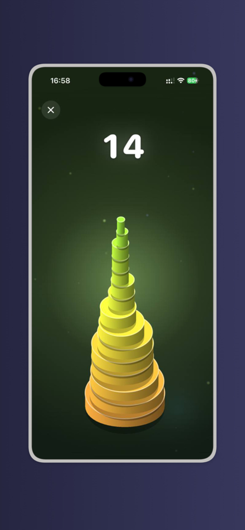
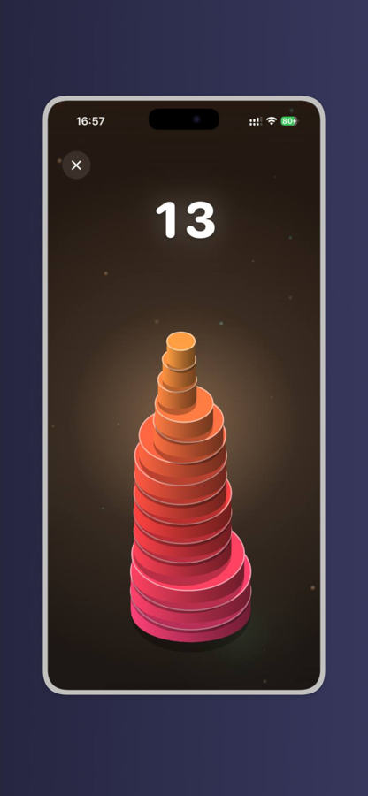
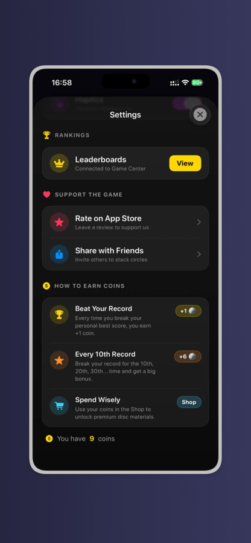
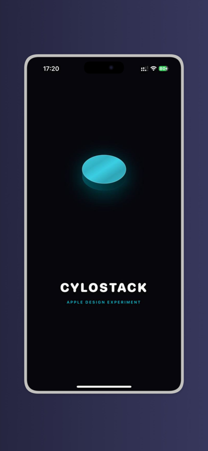
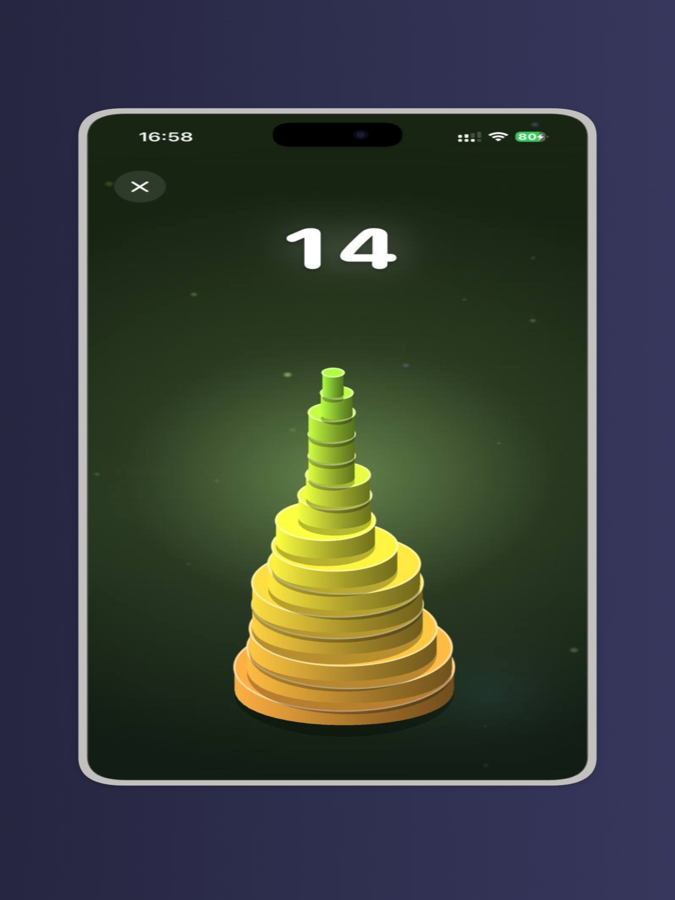

<div align="center">

# CyloStack

**A 2.5D neon stacking game for iOS — and a case study in hardware-backed API security.**

[](https://developer.apple.com)
[](https://swift.org)
[](https://developer.apple.com/spritekit/)
[](https://workers.cloudflare.com)





*Currently in review for the App Store.*

</div>

---

## What it is

Time a sliding disc, tap, and stack it. Miss the centre and the overhang is sliced away — the tower narrows until there is nothing left to land on. Nail it dead-centre and the disc keeps its full width; string enough perfect hits together and it starts growing back.

Two coupled difficulty dials — disc speed and shrink rate — give 25 distinct modes, each keeping its own personal best. The global leaderboard ranks *lifetime mastery*: every setting's best score, weighted by how hard that setting genuinely plays, then summed. Grinding a tall stack on the gentlest mode will not get you to the top.

<div align="center">


</div>

## Why the code might interest you

The game is the fun part. The part worth reading is the backend contract.

CyloStack ships remote configuration — the ability to switch each ad format on or off, push a version gate, and read install and daily-active counts — from a Cloudflare Worker. That endpoint is a public URL, which raises a question most mobile apps quietly get wrong: **how does a server know a request really came from your app?**

The usual answer is a secret compiled into the binary. It does not survive contact with a disassembler.

This repository implements the real answer, end to end:

### Apple App Attest

On first launch the app generates a key **inside the Secure Enclave**. The private half never leaves the chip — there is no secret in the binary, in this repository, or on disk to extract.

Apple vouches for that key once. The Worker verifies the attestation itself, in plain JavaScript on the edge:

- decodes the CBOR attestation statement
- parses X.509 by hand and walks the certificate chain to Apple's **pinned App Attest root CA**
- checks the attestation nonce against a **single-use, server-issued challenge**
- confirms the authenticator data names this exact app, a fresh key, and real hardware

Every later request carries an assertion signed by that key over the precise parameters being sent. A captured request cannot be replayed: challenges are burned on first use and the signature counter only moves forward.

> Implementation: [`cloudflare-worker/appattest.js`](cloudflare-worker/appattest.js) · [`AppAttestService.swift`](CircleStack/Core/Services/RemoteConfig/AppAttestService.swift)

### Encrypted config, signed requests

TLS protects the wire. It does not stop anyone who knows the URL from reading the config or forging analytics events. So:

- responses are **AES-256-GCM encrypted**; a tampered payload fails authentication and the app keeps its cached values rather than trusting it
- requests carry an **HMAC-SHA256** signature with a 5-minute freshness window
- this path is the deliberate fallback for the Simulator and devices without App Attest — weaker, and treated as such

The server reports which path actually authenticated a request, so the app notices when its attested key has been forgotten and registers a fresh one. Without that signal it would silently coast on the weaker path forever.

### Remote control from Telegram

Operations run through a Telegram bot on the same Worker: toggle each ad format, publish a version, force an update, read install and DAU counts. Access is granted by Telegram `@username`, owner-only — an invited admin can change app settings but can never hand access to anyone else.

## Architecture

```
CircleStack/
├── App/                 Scene + app delegate, per-configuration entitlements
├── Core/
│   ├── Services/
│   │   ├── AdMob/       Ad lifecycle, per-format remote gating
│   │   ├── Audio/       Procedurally synthesised SFX — no audio files ship
│   │   ├── GameCenter/  Auth, leaderboards, profile sync
│   │   ├── Network/     Reachability
│   │   └── RemoteConfig/ App Attest, request signing, payload decryption
│   └── Extensions/
├── Domain/              PlayerStore, difficulty model, materials
└── Features/
    ├── Game/            SpriteKit scene, nodes, view model
    ├── Main/            Tabs, splash, onboarding, update gate
    ├── Profile/         Profile, leaderboard cards
    └── Settings/        Difficulty, records, shop, legal

cloudflare-worker/
├── worker.js            Config API, App Attest endpoints, Telegram bot
└── appattest.js         CBOR + X.509 + attestation/assertion verification
```

Every sound in the game is synthesised at runtime — sine layers, exponential envelopes, a little noise for the collapse — so the bundle carries no audio assets at all. See [`SoundManager.swift`](CircleStack/Core/Services/Audio/SoundManager.swift).

## Building

Requires Xcode 16+ and an Apple Developer team (App Attest and Game Center both need real entitlements).

```bash
git clone https://github.com/<your-account>/cylostack.git
cd cylostack
cp CircleStack/Core/Services/RemoteConfig/Secrets.swift.template \
   CircleStack/Core/Services/RemoteConfig/Secrets.swift
```

Fill in `Secrets.swift` with the shared key, then set the same value on the Worker:

```bash
cd cloudflare-worker
npx wrangler secret put APP_SECRET
npx wrangler secret put BOT_TOKEN     # only if you want the Telegram panel
npx wrangler deploy
```

`Secrets.swift` is gitignored and never enters the repository. Point `remoteConfigURL` in [`RemoteConfigManager.swift`](CircleStack/Core/Services/RemoteConfig/RemoteConfigManager.swift) at your own Worker.

**App Attest environments.** Debug and Release use separate entitlement files, so builds run from Xcode attest against Apple's development service and App Store builds against production — automatically, with nothing to remember at archive time. Once the app is live, set `APP_ATTEST_ALLOW_DEV = "false"` in `wrangler.toml` and redeploy so development-signed builds can no longer register.

## Getting App Attest working in production

Most of the effort in this project went into the security path. Three failures, each found by running the real app on real hardware and reading real logs:

- The first attestation attempt failed with `leaf_not_trusted`. The cause was subtle: Apple signs the credential certificate with SHA-256 while the intermediate key is P-384, so deriving the digest from the parent curve rejects a perfectly valid chain. Found by reading the Worker's own logs against a real device.
- The next failure was `+` in base64 arriving as a space inside a query string, quietly breaking every signature. Diagnosed from a single logged URL, fixed by moving to base64url on both sides.
- Then `DCError.invalidKey` — Apple permits a key to be attested exactly once, so re-registration has to mint a fresh key rather than retry the old one.

Every fix in this repository was verified end to end on device before it landed.

## License

MIT — see [LICENSE](LICENSE).
